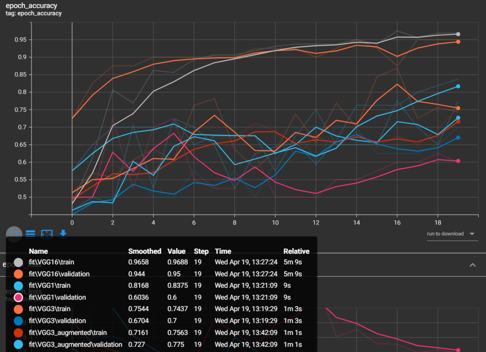

___
# Are the results as expected? Why or why not?

The relative results of model are expected i.e. VGG16 is performing best and VGG1 has the lowest accuracy among CNN models. The reason for this is that VGG16 has more convolutional layers than VGG1. So it is able to learn more features from the images. 

Also, using Image Augmentation in VGG3 gives better performance according to the results. The reason for this is that Image Augmentation helps in generalizing the model. So the model is able to learn more features from the images.

The performace of MLP is very poor as compared to CNN models. The reason for this is that MLP is not able to learn the features from the images. So it is not able to classify the images correctly. This is due CNN have spatial invariance and recognize objects irrespective of their position in the image. MLP does not have this property. So it is not able to classify the images correctly.

----
# Does data augmentation help? Why or why not?

Data augmentation helps in increasing the performance of the CNN models(in our case VGG3) in the following ways:

It creates new data points by rotating/flipping/scaling pre-existing data points. In this way, the model becomes more robust to the variations in scale and position of the objects in the test data points. 
We have a small training data set of 80 images.

Due to the above reasons, overfitting is reduced as the model has more training data points. Also, the model is more generalized as it has many different kinds of images(due to augmentation). 

Our expectations are verified by the following results. As expected, the augmented model performs better than plain VGG3:

model | Testing Accuracy(%)
--- | ---
VGG3 | 70
VGG3 + Augmentation | 77.5

---
# Does it matter how many epochs you fine tune the model? Why or why not?

I trained the model for 10 epochs, Then I trained the model for 20 epochs.
I think it matters how many epochs you fine tune the model for some epochs. But as we the loss vs epoch graph, the loss is not decreasing after 20 epochs. So I think it is not necessary to train the model for more epochs. After certain epochs, the model is not learning anything new. So we can stop training the model after those epochs.

I tried taking epoch as a hyperparameter and training the model for different epochs. But each model was taking time to train. So It was not feasible to train the model for different epochs. So I trained the model for 20 epochs and compared the results.

---
# Are there any particular images that the model is confused about? Why or why not?

There is this image of a lion which all models are confused about. The reason for this is that the image is not of a real lion but of a toy lion. So the model is not able to recognize the toy lion and confusing it with a kangaroo.

There is this image of a kangaroo which all models are confused about. The reason for this is that the image is not of a grown kangaroo but of a kid kangaroo, which is crawling out of the pouch. The image is a bit hard to recognize.
So the model is not able to recognize the kangaroo and is confusing it with a lion.

